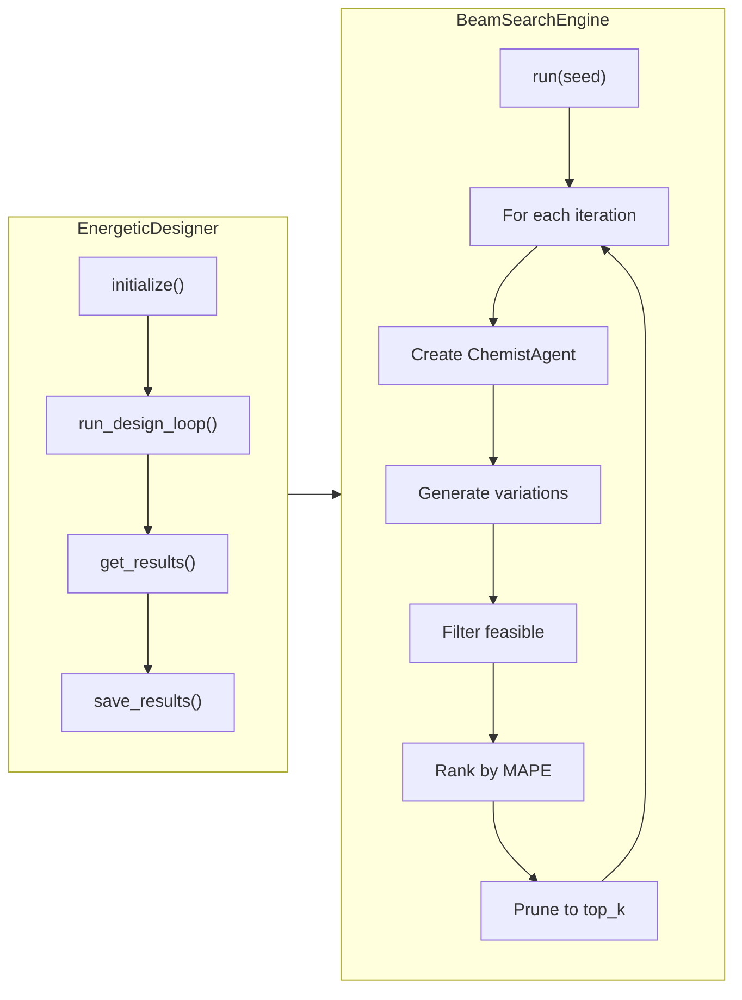
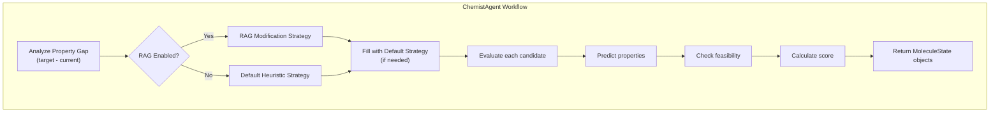
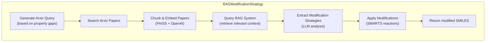
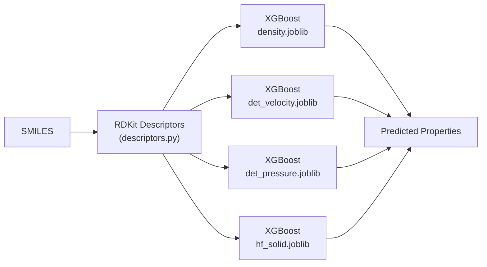
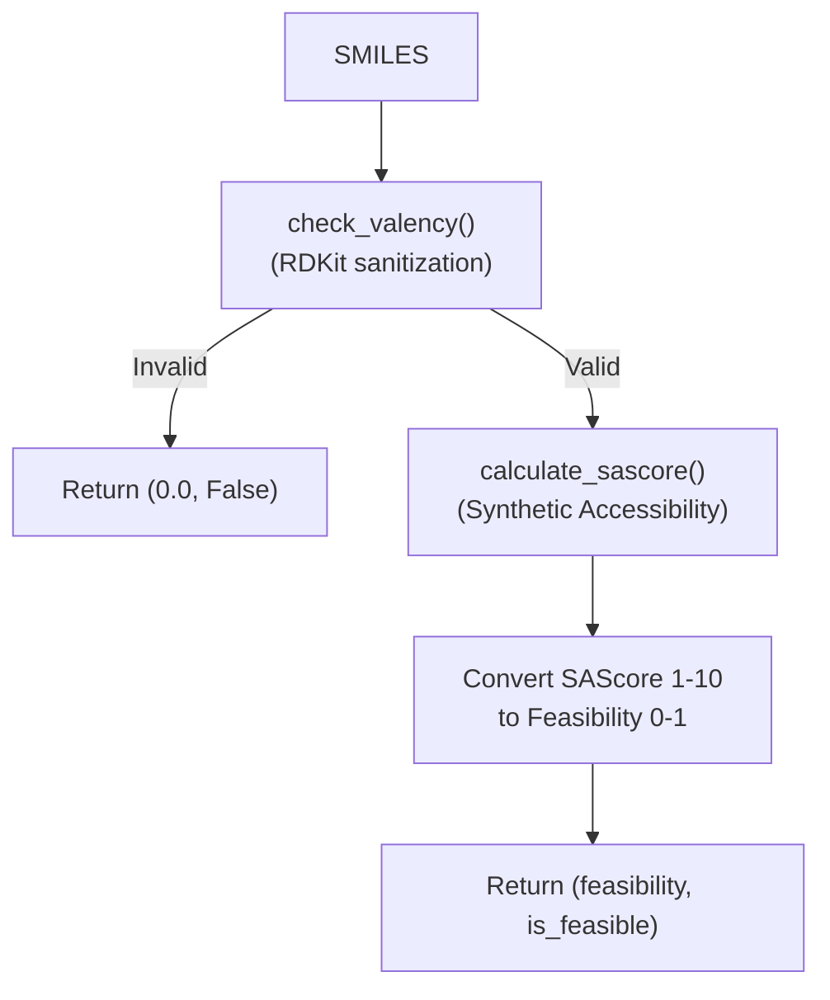
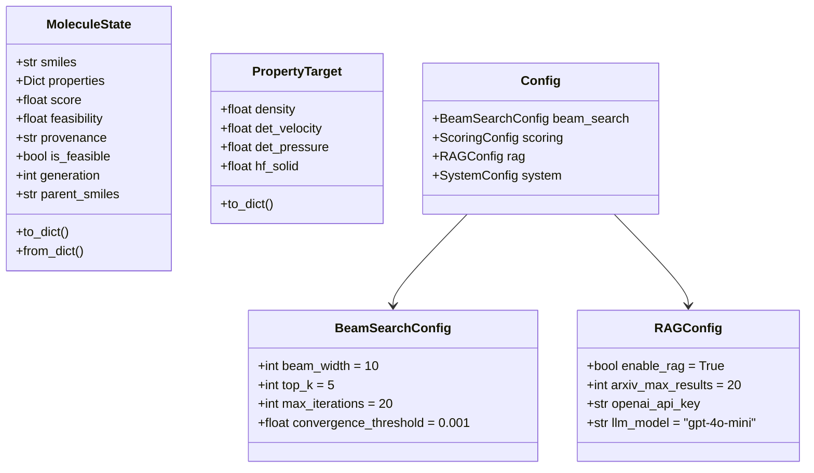
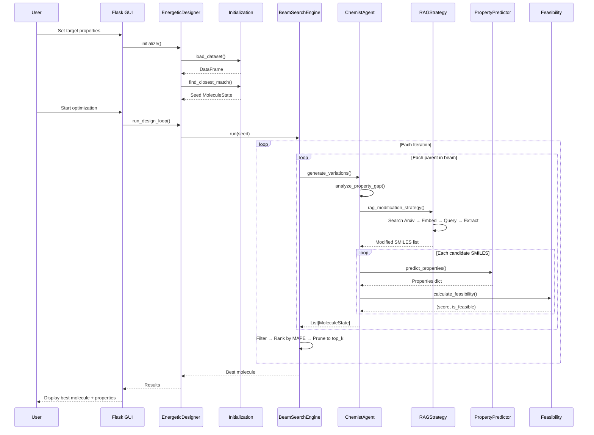

# EnergeticGraph System Design

A modular molecular design system for optimizing energetic materials using beam search, RAG-enhanced modification strategies, and ML-based property prediction.

---

## High-Level Architecture

```mermaid
flowchart TB
    subgraph User_Interface["🖥️ User Interface Layer"]
        GUI["Flask Web GUI<br/>(gui/app.py)"]
        CLI["CLI Entry Point<br/>(main.py)"]
    end

    subgraph Core_Engine["⚙️ Core Engine"]
        Designer["EnergeticDesigner<br/>(designer.py)"]
        Orchestrator["BeamSearchEngine<br/>(orchestrator.py)"]
    end

    subgraph Agents["🤖 Agent Layer"]
        WorkerAgent["ChemistAgent<br/>(agents/worker_agent.py)"]
    end

    subgraph Modules["📦 Modules Layer"]
        direction TB
        RAG["RAGModificationStrategy<br/>(modules/rag_strategy.py)"]
        ModTools["Modification Tools<br/>(modules/modification_tools.py)"]
        Prediction["PropertyPredictor<br/>(modules/prediction.py)"]
        Feasibility["Feasibility Checker<br/>(modules/feasibility.py)"]
        Scoring["Scoring Functions<br/>(modules/scoring.py)"]
        Init["Initialization<br/>(modules/initialization.py)"]
    end

    subgraph External["🌐 External Services"]
        OpenAI["OpenAI API<br/>(GPT-4o-mini + Embeddings)"]
        Arxiv["Arxiv API<br/>(Paper Search)"]
    end

    subgraph Data["💾 Data Layer"]
        Models["XGBoost Models<br/>(models/*.joblib)"]
        Dataset["Molecule Dataset<br/>(sample_start_molecules.csv)"]
        ChromaDB["FAISS VectorStore<br/>(chroma_db/)"]
    end

    subgraph DataStructures["📋 Data Structures"]
        MolState["MoleculeState"]
        PropTarget["PropertyTarget"]
        Config["Config"]
    end

    %% User Interface connections
    GUI --> Designer
    CLI --> Designer

    %% Core Engine connections
    Designer --> Init
    Designer --> Orchestrator
    Orchestrator --> WorkerAgent

    %% Agent connections
    WorkerAgent --> RAG
    WorkerAgent --> ModTools
    WorkerAgent --> Prediction
    WorkerAgent --> Feasibility
    WorkerAgent --> Scoring

    %% RAG connections
    RAG --> OpenAI
    RAG --> Arxiv
    RAG --> ChromaDB
    RAG --> ModTools

    %% Module connections to data
    Prediction --> Models
    Init --> Dataset

    %% Data structures usage
    Designer -.-> MolState
    Designer -.-> PropTarget
    Designer -.-> Config
    Orchestrator -.-> MolState
    WorkerAgent -.-> MolState

    classDef interface fill:#4CAF50,stroke:#2E7D32,color:white
    classDef core fill:#2196F3,stroke:#1565C0,color:white
    classDef agent fill:#FF9800,stroke:#EF6C00,color:white
    classDef module fill:#9C27B0,stroke:#6A1B9A,color:white
    classDef external fill:#F44336,stroke:#C62828,color:white
    classDef data fill:#607D8B,stroke:#37474F,color:white
    classDef structure fill:#00BCD4,stroke:#00838F,color:white

    class GUI,CLI interface
    class Designer,Orchestrator core
    class WorkerAgent agent
    class RAG,ModTools,Prediction,Feasibility,Scoring,Init module
    class OpenAI,Arxiv external
    class Models,Dataset,ChromaDB data
    class MolState,PropTarget,Config structure
```



---

## Component Details

### 1. User Interface Layer

| Component | File | Description |
|-----------|------|-------------|
| **Flask Web GUI** | `gui/app.py` | Modern web interface with real-time progress updates via SSE, molecule visualization, and interactive parameter controls |
| **CLI Entry** | `main.py` | Command-line interface for batch processing and scripted execution |

---

### 2. Core Engine



#### EnergeticDesigner (`designer.py`)
The high-level orchestrator that:
- Loads molecular datasets
- Finds the best seed molecule using MAPE distance
- Runs the beam search optimization
- Saves results in JSON/CSV format

#### BeamSearchEngine (`orchestrator.py`)
Manages the beam search algorithm:
- Maintains a beam of top-K candidate molecules
- Creates worker agents for each parent molecule
- Evaluates and ranks candidates by MAPE
- Tracks best molecule ever found
- Detects convergence

---

### 3. Agent Layer



#### ChemistAgent (`agents/worker_agent.py`)
Worker agent that generates molecular variations:
- Analyzes property gaps between current and target
- Uses RAG or heuristic modification strategies
- Evaluates candidates with property prediction + feasibility

---

### 4. Modules Layer

#### 4.1 RAG Modification Strategy (`modules/rag_strategy.py`)



**Key Features:**
- Uses LangChain with ChatOpenAI (GPT-4o-mini)
- Searches Arxiv for relevant chemistry papers
- Chunks documents and creates FAISS vector store
- Extracts actionable modification strategies from literature
- Applies SMARTS-based chemical reactions

#### 4.2 Modification Tools (`modules/modification_tools.py`)

| Function | Description |
|----------|-------------|
| `addition_modification()` | Adds functional groups (-NO2, -NH2, -OH, etc.) |
| `subtraction_modification()` | Removes terminal atoms/groups |
| `substitution_modification()` | Substitutes atoms (C→N, H→F, etc.) |
| `ring_modification()` | Opens/closes rings, cyclization |
| `generate_diverse_modifications()` | Combines all strategies for diversity |

#### 4.3 Property Prediction (`modules/prediction.py`)



**Predicted Properties:**
- **Density** (g/cm³)
- **Detonation Velocity** (m/s)
- **Detonation Pressure** (GPa)
- **Heat of Formation** (kJ/mol)

#### 4.4 Feasibility Checker (`modules/feasibility.py`)



**SAScore Interpretation:**
| SAScore | Feasibility | Interpretation |
|---------|-------------|----------------|
| 1-3 | 90-100% | Easy synthesis |
| 3-5 | 70-90% | Moderate |
| 5-7 | 50-70% | Challenging but doable |
| 7-10 | 0-50% | Very difficult |

#### 4.5 Scoring Functions (`modules/scoring.py`)

```
Total Score = 0.7 × (MAPE/100) + 0.3 × (1 - Feasibility)
```

Where **MAPE** (Mean Absolute Percentage Error) measures distance from target properties.

---

### 5. Data Structures (`data_structures.py`)



---

## Data Flow



---

## Directory Structure

```
EnergeticGraph/
├── 📄 main.py                 # CLI entry point
├── 📄 designer.py             # High-level EnergeticDesigner class
├── 📄 orchestrator.py         # BeamSearchEngine
├── 📄 data_structures.py      # MoleculeState, PropertyTarget, Config defs
├── 📄 config.py               # Configuration dataclasses
├── 📄 descriptors.py          # RDKit molecular descriptor generation
│
├── 📁 agents/
│   └── 📄 worker_agent.py     # ChemistAgent implementation
│
├── 📁 modules/
│   ├── 📄 rag_strategy.py     # RAG-based modification with Arxiv + LLM
│   ├── 📄 modification_tools.py # RDKit molecular modifications
│   ├── 📄 prediction.py       # XGBoost property prediction
│   ├── 📄 feasibility.py      # SAScore + valency checking
│   ├── 📄 scoring.py          # MAPE + feasibility scoring
│   └── 📄 initialization.py   # Dataset loading + seed selection
│
├── 📁 gui/
│   ├── 📄 app.py              # Flask web application
│   ├── 📁 templates/          # HTML templates
│   └── 📁 static/             # CSS, JS, images
│
├── 📁 models/                  # Trained XGBoost models
│   ├── 📄 density.joblib
│   ├── 📄 det_velocity.joblib
│   ├── 📄 det_pressure.joblib
│   └── 📄 hf_solid.joblib
│
├── 📁 chroma_db/               # FAISS vector store data
├── 📄 sample_start_molecules.csv # Seed molecule dataset
└── 📄 requirements.txt
```

---

## Key Algorithms

### Beam Search Optimization

```
Algorithm: Beam Search for Molecular Design
Input: seed_molecule, target_properties, beam_width, top_k, max_iterations
Output: best_molecule

1. beam ← [seed_molecule]
2. best_ever ← seed_molecule

3. for iteration = 1 to max_iterations:
    a. candidates ← []
    b. for each parent in beam:
        i.   agent ← ChemistAgent(parent, target_properties)
        ii.  variations ← agent.generate_variations()
        iii. candidates.extend(variations)
    
    c. feasible ← filter(candidates, λm: m.is_feasible)
    d. unique ← remove_duplicates(feasible)
    e. ranked ← sort(unique, by=MAPE, ascending=True)
    f. beam ← ranked[0:top_k]
    
    g. if MAPE(beam[0]) < MAPE(best_ever):
        best_ever ← beam[0]
    
    h. if converged(improvement < threshold):
        break

4. return best_ever
```

### MAPE Distance Calculation

```
MAPE = (100/n) × Σ |predicted_i - target_i| / |target_i|
```

---

## External Dependencies

| Dependency | Purpose |
|------------|---------|
| **RDKit** | Molecular structure handling, SMARTS reactions, descriptors |
| **XGBoost** | Property prediction models |
| **LangChain** | RAG pipeline orchestration |
| **OpenAI API** | GPT-4o-mini for LLM, text-embedding-3-small for embeddings |
| **FAISS** | Vector similarity search for RAG |
| **Flask** | Web application framework |
| **Arxiv API** | Scientific paper retrieval |

---

## Configuration Options

```python
# Beam Search Parameters
beam_width = 10          # Candidates to keep per iteration
top_k = 5                # Top candidates to select
max_iterations = 20      # Maximum search iterations
convergence_threshold = 0.001

# Scoring Weights
mape_weight = 0.7        # Property accuracy importance
feasibility_weight = 0.3 # Synthetic feasibility importance

# RAG Settings
enable_rag = True
arxiv_max_results = 20
llm_model = "gpt-4o-mini"
llm_temperature = 0.3
```
