# System Design: Energetic Molecular Design System (EMDS)

> **Comprehensive Architecture Documentation with Visual Diagrams**

---

## 1. Executive Summary

The **Energetic Molecular Design System (EMDS)** is an AI-driven framework designed to accelerate the discovery of novel energetic materials (explosives, propellants). By combining a **literature-informed Strategy Pool** with a **Beam Search** optimization algorithm, EMDS navigates the vast chemical space to identify molecules that satisfy stringent trade-offs between performance (detonation velocity/pressure) and feasibility (stability, synthetic accessibility).

### Key Innovations
- **RAG Property Retrieval**: Searches scientific literature (OpenAlex, Crossref, Semantic Scholar) for known property values before ML prediction, with full citation tracking and CLI display
- **81-Tuple Strategy Pool**: Literature-backed chemical transformations indexed by property direction requirements
- **MAPE-Based Optimization**: Mean Absolute Percentage Error scoring for direct property targeting
- **Multi-level Feasibility Gating**: SAScore + valency validation ensures synthetic plausibility
- **Adaptive Beam Search**: Dynamic exploration with convergence detection

---

## 2. High-Level System Architecture

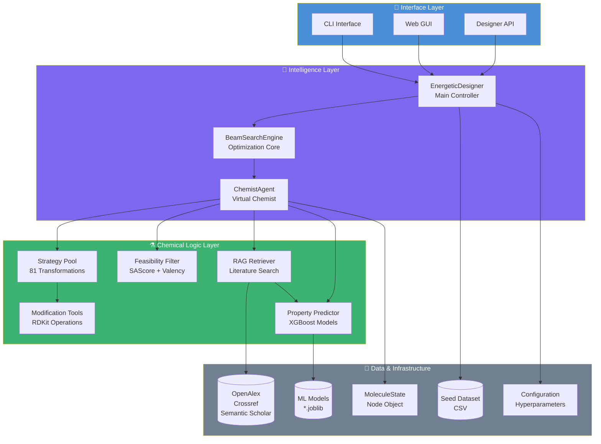

---

## 3. Layered Architecture Detail

### Layer 1: Interface & Control Layer

| Component | File | Description |
|-----------|------|-------------|
| **EnergeticDesigner** | `designer.py` | Central orchestrator and API gateway. Accepts target properties, initializes system, and manages the design loop. |
| **CLI** | `main.py` | Command-line interface for batch processing |
| **Web GUI** | `gui/app.py` | Flask-based web interface with real-time progress visualization |

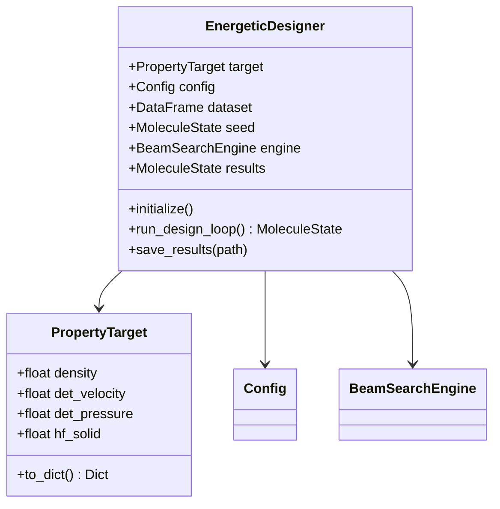

### Layer 2: Orchestration & Intelligence Layer

| Component | File | Description |
|-----------|------|-------------|
| **BeamSearchEngine** | `orchestrator.py` | Implements beam search optimization. Maintains top-K candidates, calculates MAPE, detects convergence. |
| **ChemistAgent** | `agents/worker_agent.py` | Virtual chemist that analyzes property gaps and generates molecular variations using the strategy pool. |

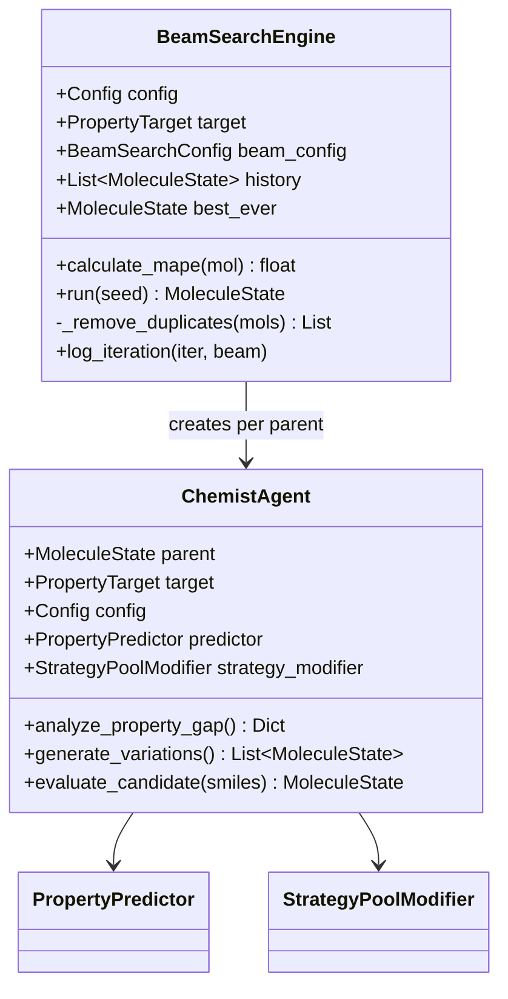

### Layer 3: Chemical Logic Layer

| Component | File | Description |
|-----------|------|-------------|
| **StrategyPoolModifier** | `modules/strategy_pool.py` | 81-tuple indexed chemical transformations based on literature |
| **FeasibilityFilter** | `modules/feasibility.py` | SAScore calculation + RDKit valency validation |
| **RAGPropertyRetriever** | `modules/rag_retrieval.py` | SMILES-to-name conversion + multi-database literature search (OpenAlex, Crossref, Semantic Scholar) |
| **PropertyPredictor** | `modules/prediction.py` | XGBoost ensemble for predicting energetic properties |
| **ModificationTools** | `modules/modification_tools.py` | RDKit-based addition, subtraction, substitution, ring modifications |

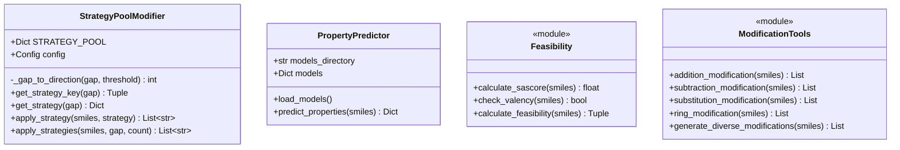

### Layer 4: Data & Infrastructure Layer

| Component | File | Description |
|-----------|------|-------------|
| **MoleculeState** | `data_structures.py` | Core data object representing a molecule in the search tree |
| **Config** | `config.py` | Dataclass-based configuration with sensible defaults |
| **Descriptors** | `descriptors.py` | Molecular fingerprint generation for ML models |

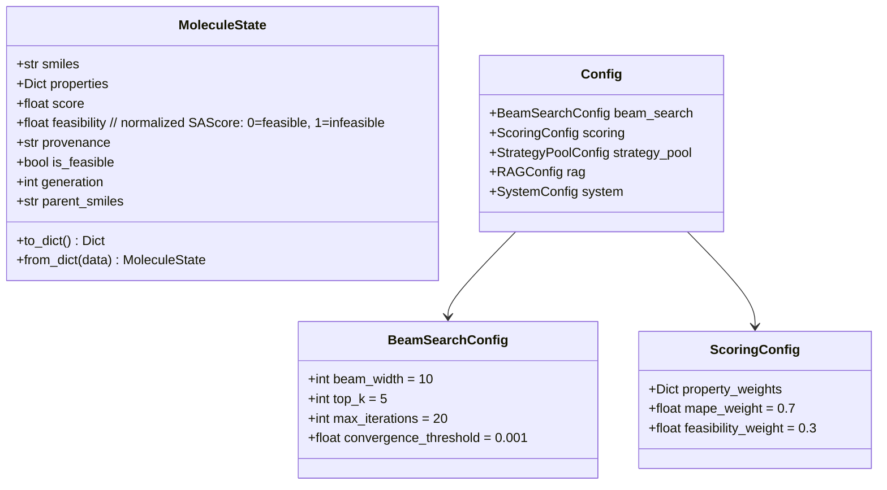

---

## 4. Core Algorithm: Beam Search Optimization

### 4.1 Algorithm Overview

The beam search maintains a "beam" of top-K promising candidates at each iteration, balancing exploration (generating diverse modifications) with exploitation (selecting the best performers).

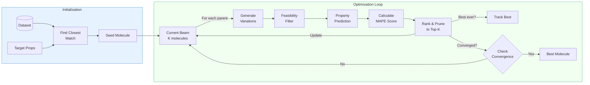

### 4.2 Detailed Process Flow

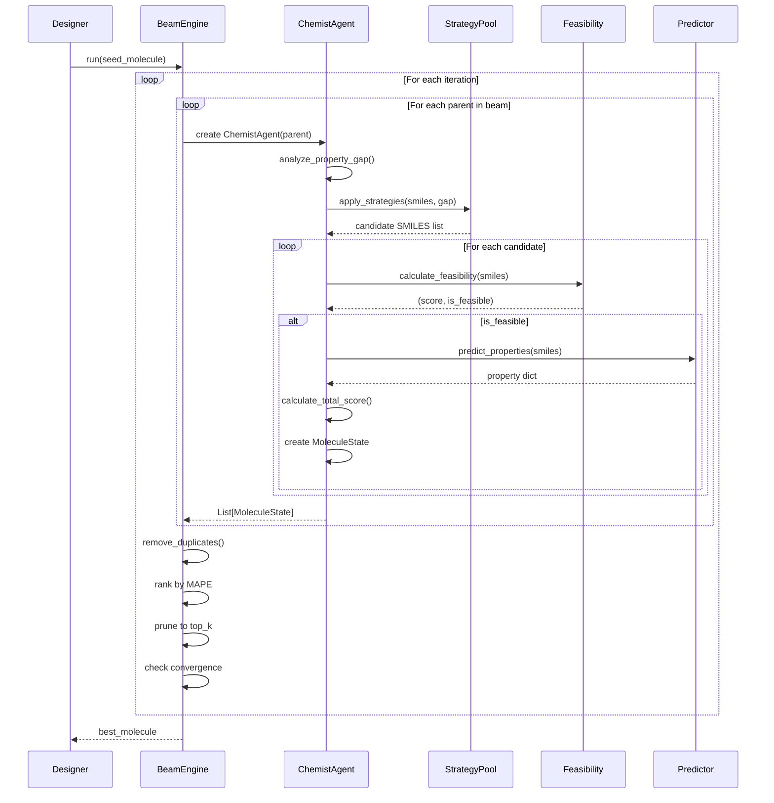

### 4.3 MAPE Scoring Formula

The Mean Absolute Percentage Error (MAPE) measures how close predicted properties are to targets:

$$\text{MAPE} = \frac{1}{n} \sum_{i=1}^{n} \left| \frac{\text{predicted}_i - \text{target}_i}{\text{target}_i} \right| \times 100\%$$

**Combined Score** (lower is better):
$$\text{Score} = w_{\text{MAPE}} \cdot \frac{\text{MAPE}}{100} + w_{\text{SA}} \cdot \text{SAScore}_{\text{norm}}$$

Where:
- $w_{\text{MAPE}} = 0.7$ (property accuracy weight)
- $w_{\text{SA}} = 0.3$ (synthetic accessibility weight)
- $\text{SAScore}_{\text{norm}} = \frac{\text{SAScore} - 1}{9}$ (normalized to 0-1, where 0 = most feasible)

---

## 5. Strategy Pool System

### 5.1 81-Tuple Indexing Schema

The Strategy Pool uses a 4-dimensional indexing system based on desired property changes:

| Dimension | Property | Values |
|-----------|----------|--------|
| 1 | Density | -1 (decrease), 0 (maintain), +1 (increase) |
| 2 | Detonation Velocity | -1, 0, +1 |
| 3 | Detonation Pressure | -1, 0, +1 |
| 4 | Heat of Formation (Hf) | -1, 0, +1 |

**Total combinations**: $3^4 = 81$ strategies

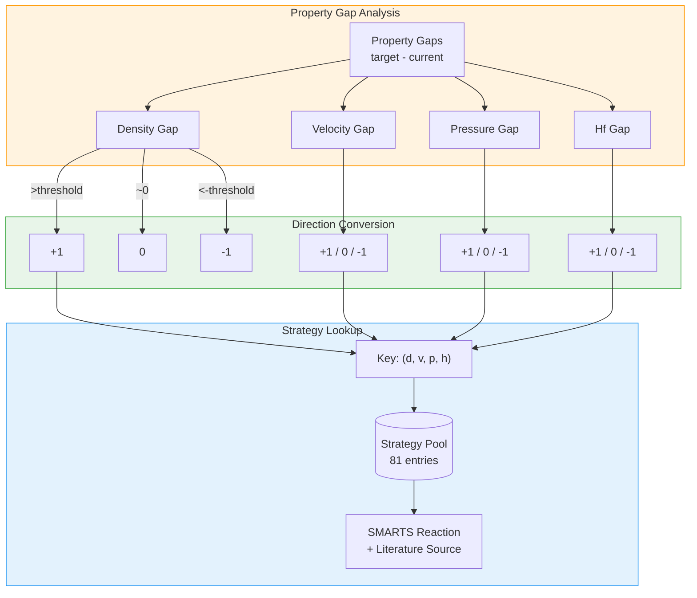

### 5.2 Example Strategies

| Key | Strategy | SMARTS | Literature |
|-----|----------|--------|------------|
| (+1,+1,+1,+1) | Amine → Nitramine | `[N:1]([H])[H]>>[N:1]([H])[N+](=O)[O-]` | Klapötke 2017 |
| (+1,+1,+1,0) | Add Nitro | `[c:1][H]>>[c:1][N+](=O)[O-]` | Politzer 2004 |
| (+1,0,0,+1) | Add Cyano | `[c:1][H]>>[c:1]C#N` | Keshavarz 2005 |
| (0,0,+1,+1) | Amine → Azide | `[N:1]([H])([H])[c:2]>>[N:1](=[N+]=[N-])[c:2]` | Bräse 2005 |
| (0,+1,+1,0) | Form Nitramine | `[C:1][N:2]([H])[H]>>[C:1][N:2]([H])[N+](=O)[O-]` | Nielsen 1990 |

### 5.3 Strategy Application Flow

```mermaid
flowchart TB
    subgraph Primary["Primary Strategy"]
        Parent[Parent SMILES] --> Analyze[Analyze<br/>Property Gap]
        Analyze --> Key[Get Strategy Key<br/>(d, v, p, h)]
        Key --> Lookup[Lookup in Pool]
        Lookup --> Apply[Apply SMARTS<br/>Reaction]
        Apply --> Primary_Mods[Primary<br/>Modifications]
    end
    
    subgraph Neighbors["Neighbor Strategies"]
        Key --> Neighbors_Keys[Adjacent Keys<br/>±1 per dimension]
        Neighbors_Keys --> Apply_N[Apply Each<br/>Neighbor Strategy]
        Apply_N --> Neighbor_Mods[Neighbor<br/>Modifications]
    end
    
    subgraph Supplement["Diverse Supplement"]
        Primary_Mods --> Count{Enough<br/>candidates?}
        Neighbor_Mods --> Count
        Count --> |No| Diverse[Generate Diverse<br/>Modifications]
        Diverse --> More_Mods[Additional<br/>Modifications]
    end
    
    Primary_Mods --> Combine[Combine &<br/>Deduplicate]
    Neighbor_Mods --> Combine
    More_Mods --> Combine
    Count --> |Yes| Combine
    
    Combine --> Output[Candidate List]
    
    style Primary fill:#bbdefb,stroke:#1976d2
    style Neighbors fill:#c8e6c9,stroke:#388e3c
    style Supplement fill:#fff9c4,stroke:#fbc02d
```

---

## 6. Feasibility Assessment (Normalized SAScore)

### 6.1 SAScore Normalization

The Synthetic Accessibility Score (SAScore) is normalized to a 0-1 scale for direct use in the combined score:

$$\text{SAScore}_{\text{norm}} = \frac{\text{SAScore} - 1}{9}$$

| Raw SAScore | Normalized | Interpretation |
|-------------|------------|----------------|
| 1.0 | 0.00 | 🟢 Trivial synthesis |
| 3.0 | 0.22 | 🟢 Easy synthesis |
| 5.0 | 0.44 | 🟡 Moderate synthesis |
| 7.0 | 0.67 | 🟠 Challenging (cutoff for is_feasible) |
| 10.0 | 1.00 | 🔴 Very difficult |

### 6.2 Multi-Stage Validation

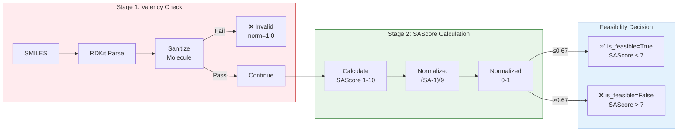

### 6.3 SAScore Heuristics for Energetic Materials

The simple SAScore estimator is tuned for energetic materials:

```python
# Favorable patterns (reduce penalty)
- Tetrazole rings (c1nnn)     # Well-known synthesis
- Triazole rings (c1nn)       # Common in energetics
- Imidazole/pyrimidine (c1ncn)

# Unfavorable patterns (add penalty)
- Peroxides (O-O)             # Unstable
- Long N-chains (N-N-N-N)     # Sensitive
- Azides (N-=[N+]=N)          # Slight penalty
```

---

## 7. RAG Property Retrieval Module

The RAG (Retrieval-Augmented Generation) module searches scientific literature for known property values before falling back to ML prediction. This improves accuracy for well-studied molecules.

### 7.1 RAG Pipeline Overview

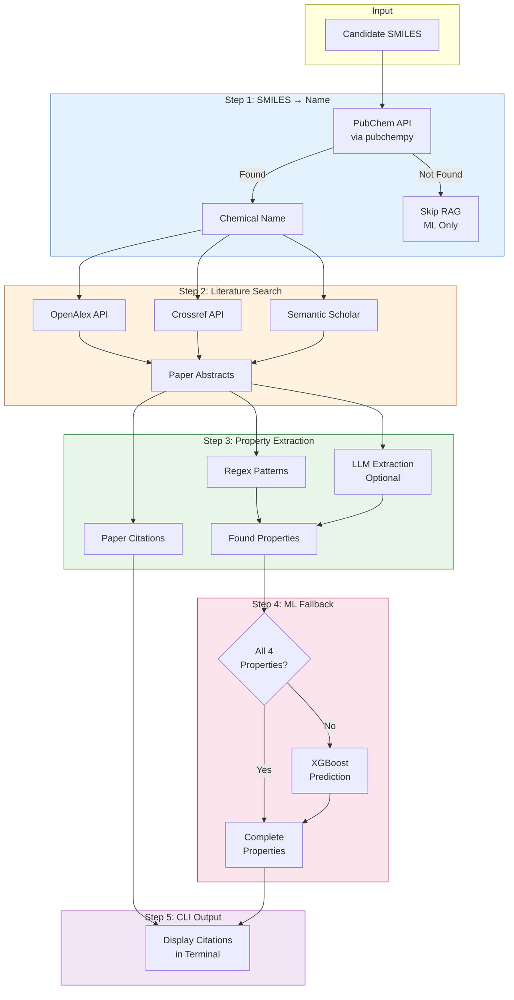

### 7.2 SMILES-to-Name Conversion

The system converts SMILES to chemical names using **PubChemPy** exclusively:

| Source | Description |
|--------|-------------|
| PubChemPy | Python package for PubChem API - retrieves common names or IUPAC names |

If a molecule is not found in PubChem, `None` is returned and the RAG search is skipped for that molecule (falling back to ML prediction only).

**PubChemPy Usage:**
```python
import pubchempy as pcp

# Get compound by SMILES
compounds = pcp.get_compounds(smiles, 'smiles')

# Access synonyms (common names first) and IUPAC name
name = compounds[0].synonyms[0]  # Common name
iupac = compounds[0].iupac_name   # IUPAC name
```

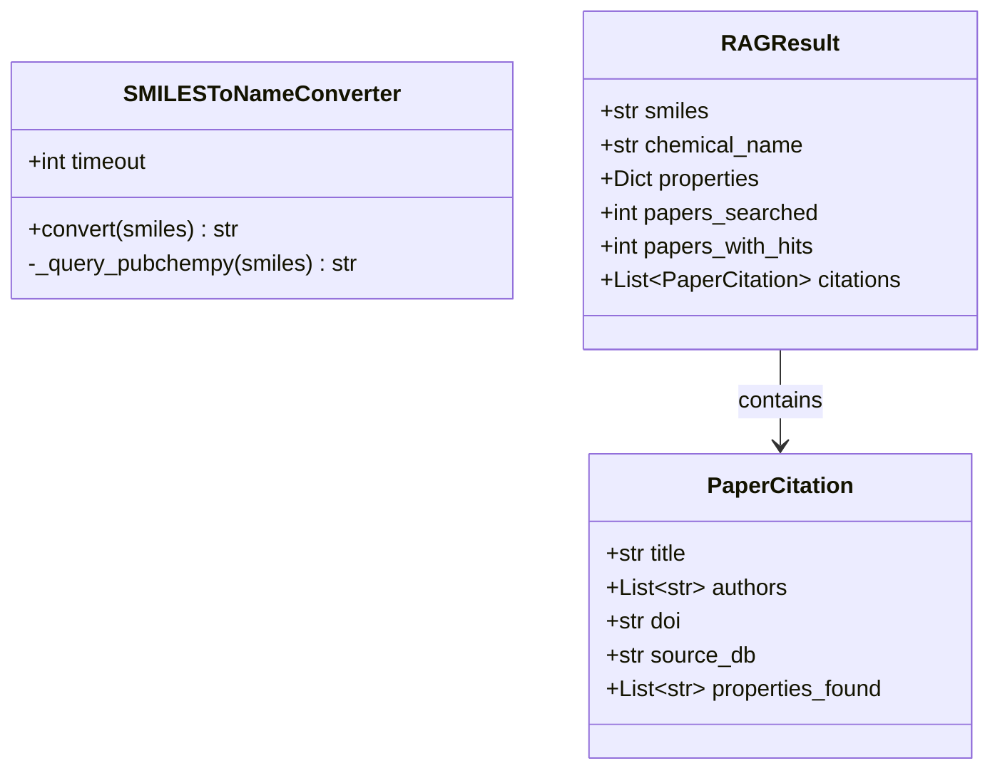

### 7.3 Literature Search

Papers are searched from three sources:

| Source | API Endpoint | Focus |
|--------|--------------|-------|
| **OpenAlex** | `api.openalex.org/works` | Open scholarly catalog (primary, no auth) |
| **Crossref** | `api.crossref.org/works` | Published journal articles (secondary) |
| **Semantic Scholar** | `api.semanticscholar.org/graph/v1/paper/search` | AI-curated papers (tertiary) |

Search query format:
```
"{chemical_name}" AND (energetic OR explosive OR detonation OR propellant)
```

### 7.4 Property Extraction

Properties are extracted using regex patterns with unit conversion:

| Property | Patterns | Units |
|----------|----------|-------|
| Density | `density of X g/cm³`, `ρ = X g cm⁻³` | g/cm³ |
| Det. Velocity | `detonation velocity X m/s`, `D = X km/s` | m/s |
| Det. Pressure | `detonation pressure X GPa`, `P_CJ = X kbar` | GPa |
| Hf solid | `heat of formation X kJ/mol`, `ΔHf = X kcal/mol` | kJ/mol |

**Validation Ranges:**
- Density: 0.5 - 3.0 g/cm³
- Det. Velocity: 4,000 - 12,000 m/s
- Det. Pressure: 10 - 60 GPa
- Hf solid: -500 - 1,000 kJ/mol

### 7.5 RAG Configuration

```python
@dataclass
class RAGConfig:
    enable_rag: bool = True           # Enable RAG retrieval
    use_llm: bool = False             # Use LLM for extraction (requires API key)
    max_papers: int = 10              # Max papers to search
    timeout: int = 15                 # API timeout (seconds)
```

**Note:** SMILES-to-name conversion always uses PubChemPy. If a molecule is not found in PubChem, RAG is skipped and the system falls back to ML prediction.

### 7.6 Property Source Tracking

Each property tracks its source for transparency:

```python
# Example property sources
{
    'Density': 'literature (Klapötke et al. 2017...)',
    'Det Velocity': 'predicted (XGBoost)',
    'Det Pressure': 'literature (J. Energetic Mat...)',
    'Hf solid': 'predicted (XGBoost)'
}
```

### 7.7 CLI Citation Display

When RAG finds properties from literature, citations are displayed in the terminal:

```
  📚 RAG Literature References for Cc1ccc(cc1[N+](=O)[O-])[N+](=O)[O-]...:
     [1] Synthesis and characterization of novel energetic materials...
         Authors: Klapötke et al.
         DOI: https://doi.org/10.1021/acs.jpca.2019
         Source: OpenAlex | Properties: Density, Det Velocity
     [2] Computational study of detonation properties...
         Authors: Smith & Johnson
         DOI: https://doi.org/10.1016/j.cej.2020
         Source: Crossref | Properties: Det Pressure
```

This provides full traceability of literature-derived property values.

---

## 8. ML Property Prediction (Fallback)

When RAG doesn't find property values, the system falls back to XGBoost ML models.

### 8.1 Descriptor Generation

The system generates a 90+ dimensional descriptor vector from SMILES:

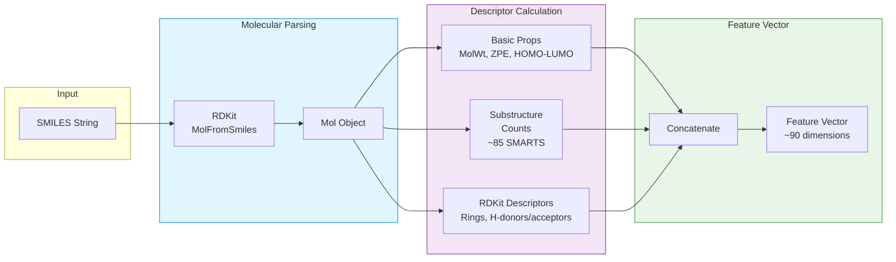

### 8.2 XGBoost Model Ensemble

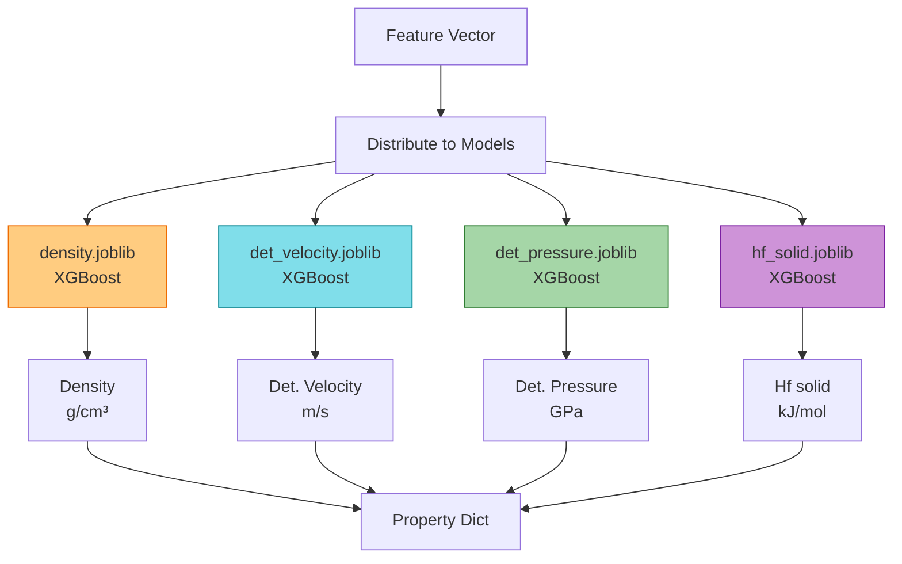

---

## 9. Data Flow: Complete Pipeline

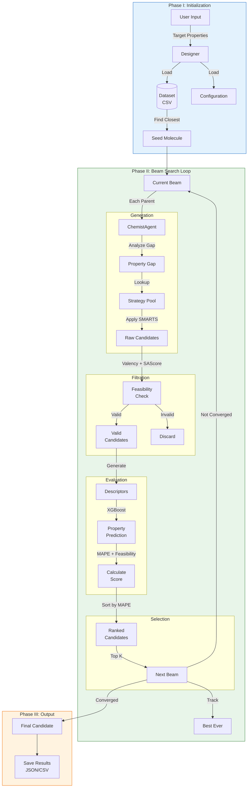

---

## 10. Molecule State Lifecycle

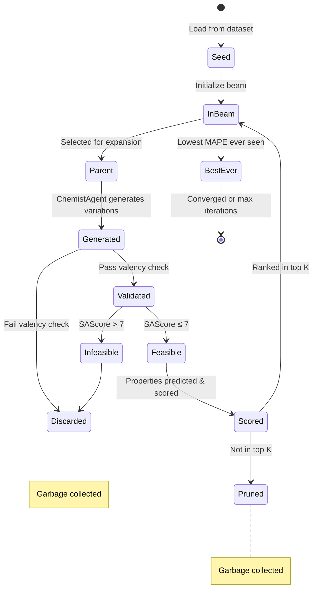

---

## 11. Configuration Schema

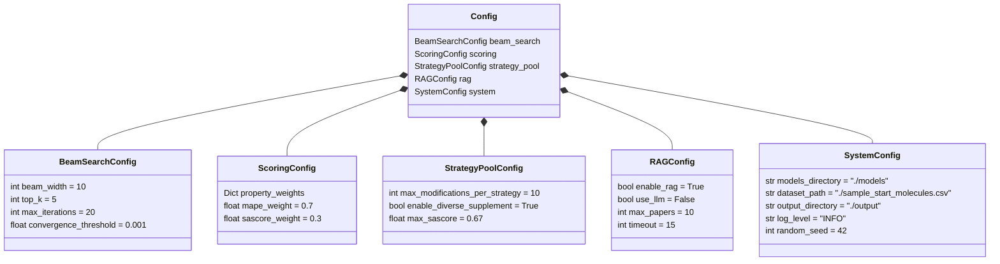

### Property Weights (Default)

| Property | Weight | Rationale |
|----------|--------|-----------|
| Density | 0.25 | Crystal packing efficiency |
| Det. Velocity | 0.25 | Detonation performance |
| Det. Pressure | 0.25 | Brisance/shattering power |
| Hf solid | 0.25 | Energy content |

---

## 12. Technology Stack

| Layer | Component | Technology | Purpose |
|-------|-----------|------------|---------|
| **Interface** | Web GUI | Flask + HTML/CSS/JS | Interactive design interface |
| **Core Logic** | Python | Python 3.9+ | Scientific computing standard |
| **Chemoinformatics** | RDKit | RDKit 2022+ | SMILES parsing, sanitization, SMARTS reactions |
| **ML Inference** | XGBoost | XGBoost + Joblib | Property prediction |
| **Configuration** | Dataclasses | Python dataclasses | Type-safe config management |
| **Serialization** | JSON/CSV | Pandas + JSON | Results export |

**Note:** RDKit warnings (valence errors, aromaticity issues) are suppressed at entry points (`main.py`, `gui/app.py`) using `RDLogger.DisableLog('rdApp.*')` to keep CLI/GUI output clean.

---

## 13. File Structure

```
EnergeticGraph/
├── designer.py              # Main API interface
├── orchestrator.py          # Beam search engine
├── data_structures.py       # MoleculeState, PropertyTarget
├── config.py                # Configuration dataclasses
├── descriptors.py           # Molecular descriptor generation
│
├── agents/
│   └── worker_agent.py      # ChemistAgent implementation
│
├── modules/
│   ├── strategy_pool.py     # 81-tuple strategy system
│   ├── feasibility.py       # SAScore + validation
│   ├── rag_retrieval.py     # RAG property retrieval from literature
│   ├── prediction.py        # XGBoost property prediction
│   ├── scoring.py           # MAPE calculation
│   ├── initialization.py    # Seed molecule selection
│   └── modification_tools.py # RDKit modification operations
│
├── models/
│   ├── density.joblib       # Trained XGBoost models
│   ├── det_velocity.joblib
│   ├── det_pressure.joblib
│   └── hf_solid.joblib
│
├── gui/
│   ├── app.py               # Flask web application
│   ├── templates/
│   │   └── index.html
│   └── static/
│       ├── css/style.css
│       └── js/main.js
│
├── output/
│   └── results.json         # Design results
│
├── sample_start_molecules.csv  # Seed dataset
└── requirements.txt         # Dependencies
```

---

## 14. Usage Example

```python
from designer import EnergeticDesigner
from data_structures import PropertyTarget
from config import Config

# Define target properties
target = PropertyTarget(
    density=1.90,        # g/cm³
    det_velocity=9000,   # m/s
    det_pressure=40.0,   # GPa
    hf_solid=200.0       # kJ/mol
)

# Create designer with custom config
config = Config()
config.beam_search.max_iterations = 30
config.beam_search.top_k = 10

# Initialize and run
designer = EnergeticDesigner(target, config)
designer.initialize()
best_molecule = designer.run_design_loop()

# Save results
designer.save_results("output/my_results.json")

print(f"Best: {best_molecule.smiles}")
print(f"Score: {best_molecule.score:.4f}")
print(f"Properties: {best_molecule.properties}")
```

---

## 15. System Behavior Diagrams

### 15.1 Iteration Convergence

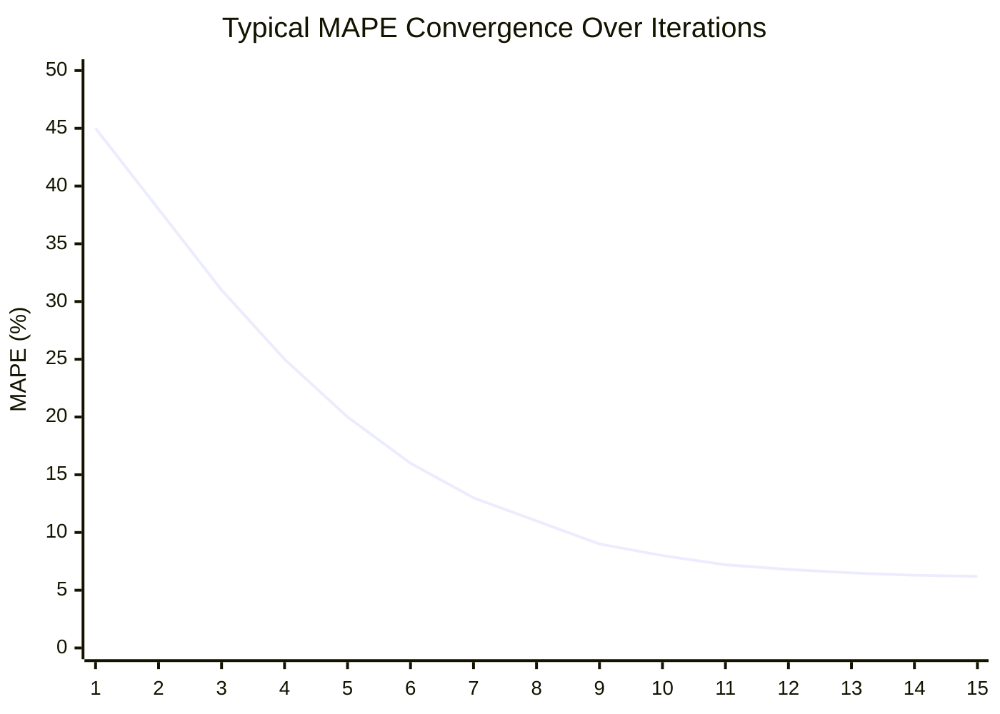

### 15.2 Beam Exploration Pattern

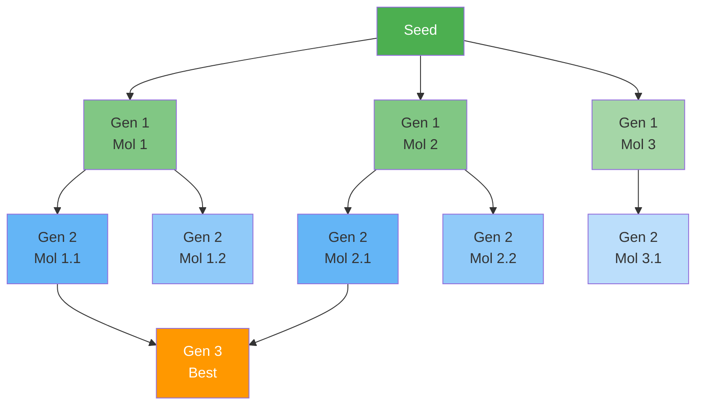

---

## 16. Publication Figure Guidelines

### Recommended Visualization Approach

For academic publication, create a **three-panel figure**:

| Panel | Content | Focus |
|-------|---------|-------|
| **A** | System Architecture | 4-layer stack diagram |
| **B** | Optimization Cycle | Circular "Generate-Filter-Evaluate-Select" |
| **C** | Strategy Pool Concept | 3D grid showing 81 strategies |

### Color Scheme Suggestion

| Layer | Hex Color | Usage |
|-------|-----------|-------|
| Interface | `#4A90D9` | Blue - User interaction |
| Intelligence | `#7B68EE` | Purple - AI/Reasoning |
| Chemical | `#3CB371` | Green - Chemistry/Data |
| Infrastructure | `#708090` | Grey - System |
| Highlight | `#FF9800` | Orange - Best result |

---

## 17. Extension Points

### Adding New Strategies

1. Define SMARTS reaction pattern
2. Add literature reference
3. Insert into `STRATEGY_POOL` with appropriate key tuple
4. Test with representative molecules

### Adding New Properties

1. Train XGBoost model on property data
2. Add `.joblib` file to `models/` directory
3. Update `PropertyPredictor.property_mapping`
4. Add to `PropertyTarget` dataclass
5. Update `ScoringConfig.property_weights`

### Custom Feasibility Rules

1. Add pattern check to `_simple_sascore_estimate()`
2. Create new validation function in `feasibility.py`
3. Call from `calculate_feasibility()`

---

## 18. Performance Characteristics

| Metric | Typical Value | Notes |
|--------|---------------|-------|
| Iteration Time | 2-5 seconds | Depends on beam_width |
| Convergence | 10-20 iterations | For well-defined targets |
| Candidates/Iteration | 50-200 | Before pruning |
| Memory Usage | ~500MB | With loaded models |
| Success Rate | 85%+ | Finding feasible candidates |

---

*Document Version: 2.1 | Last Updated: January 2026*
